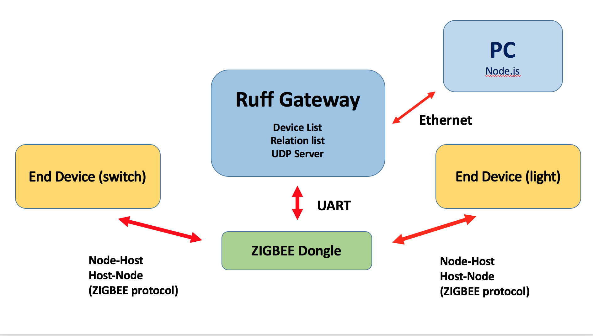

# 工作原理示意图


＝＝＝＝＝＝＝＝＝＝＝＝＝＝＝＝＝＝＝＝＝＝＝＝＝＝＝＝＝＝＝＝＝＝＝＝＝＝＝＝＝＝＝＝＝＝＝＝＝＝＝＝＝＝＝＝

# 终端命令：

```sh
1. permitjoining #允许设备加入
2. listdevies #打印设备列表
3. listrelations #打印绑定列表
3. onlinedevice #显示在线设备，设备短地址，设备状态
4. name  <longaddress>  <deviceID> #设置设备名，每一项空格隔开
5. relation <relation name> <emitter shortaddress> <receiver shortaddress> <emitter button> <receiver button> #设置绑定关系，按如上顺序输入：relation，关系名，发送装置短地址，接受装置短地址，发射装置按钮（left right single)，接受装置按钮（left right single)
6. control <receiver shortaddress> <button> <on/off> #控制灯的开关，按顺序输入： control，接受装置短地址，接受装置按钮（left right single），on或者off
7. checkstatus <receiver shortaddress> #查询设备状态
8. saverelationlist #保存关系列表到本地
9. savedevicelist #保存设备列表到本地
10. removedevice <device longaddress> #删除设备列表中设备，输入IEEEaddress（长地址）
11. removerelation <relation name> #删除关系列表中关系，输入关系名称
12. cleanrelationlist #清空关系列表
13. cleandevicelist #清空设备列表
14. help #node命令指南
15. g <IP addr> #设置网关IP
16. status #查询网关当前状态
```

> 注： 在删除设备和清空设备列表以后，设备依然联网，还会接受和发送消息，请长按按钮使其退网。正常使用时长按设备使其退网，设备会自动在列表中删除。

＝＝＝＝＝＝＝＝＝＝＝＝＝＝＝＝＝＝＝＝＝＝＝＝＝＝＝＝＝＝＝＝＝＝＝＝＝＝＝＝＝＝＝＝＝＝＝＝＝＝＝＝＝＝＝＝

# 操作流程：

1. 在连接网关后，获取网关IP

2. 将 zigbee 信号发射外设（dongle）插入网关uart接口

3. 打开 **node-zigbee-console**

4. **g**  设置IP

5. **status** 确认状态

6. **permitjoining** 允许设备加入，dongle 黄灯闪烁即可, 绿灯亮表示不可加入

7. 长按想要入网设备的按钮，蓝灯闪烁时，入网成功，

8. 在终端上输入：**listdevices** 确认设备在列表中

9. 命名设备，输入：**name 长地址 名字**， 即可命名，

10. 输入 **onlinedevice** 查看设备状态，

>注： 设备类型目前分为五种：单开关（0x10），双开关（0x11），单开关灯（0x20），双开关灯（0x21), 未知设备（0x12)。 设备识别码会以十进制的形式在 device.type 中出现。单开关和双开关的状态都是 NA，单开关灯有一个on/off， 双开关灯有两个。

11. 输入 **relation** 命令，输入绑定设备的信息，即可绑定关系，实现控制。

12. 使用 **listrelations** 命令，可以查看关系列表。

13. 可以使用 **control** 命令控制设备开关。

14. **removerelation**， **removedevice** 可以删除设备，但要在使用后手动使设备退网。删除关系可以放心使用

15. **cleanrelationlist**， **cleandevicelist** 可以清空关系列表和设备列表

>注：在执行每次操作后，强烈建议储存设备列表和关系列表(savedevicelist, saverelationlist)，这样在断电后信息不会丢失

＝＝＝＝＝＝＝＝＝＝＝＝＝＝＝＝＝＝＝＝＝＝＝＝＝＝＝＝＝＝＝＝＝＝＝＝＝＝＝＝＝＝＝＝＝＝＝＝＝＝＝＝＝＝＝＝

# 设备对象和关系对象介绍：

－－－－－－－－－－－－－－－－－－－－－－－－－－－－－－－－－－－－－－－－－－－－－－－－－

## 设备对象：
```js
var OFF = 0;
var ON = 1;

var SINGLE_SWITCH = 0x10;
var DOUBLE_SWITCH = 0x11;
var SINGLE_SOCKET = 0x20;
var DOUBLE_SOCKET = 0x21;
var UNKNOWN = 0x12;

function Device(options) {

    this.shortAddress = options.shortAddress || '0x00'; 
    this.IEEEAddress = options.IEEEAddress || '0x0000000000000000';

    this.state = options.state || OFF;
    this.leftState = options.leftState || null;
    this.rightState = options.rightState || null;

    this.type = options.type || SINGLT_SWITCH;
    this.online = options.online || false;
    this.content = {};
    this.controlledBy = [];

    this.deviceID = options.devName || 'emptyName';
}

module.exports = {
    Device: Device,
    SINGLE_SWITCH: SINGLE_SWITCH,
    DOUBLE_SWITCH: DOUBLE_SWITCH,
    SINGLE_SOCKET: SINGLE_SOCKET,
    DOUBLE_SOCKET: DOUBLE_SOCKET,
    UNKNOWN: UNKNOWN,
    OFF: OFF,
    ON: ON
}
```
**shortAddress**：设备短地址
**IEEEAddress**：设备长地址
**state：设备状态**（仅限单开关灯）
**leftState**：双开关灯左按钮状态
**rightState**：双开关灯右按钮状态
**type**：设备种类
**online**：是否在线
**deviceID**：设备名

－－－－－－－－－－－－－－－－－－－－－－－－－－－－－－－－－－－－－－－－－－－－－－－－－

## 关系对象： 
```js
'use strict';

var LEFT_EP_SWITCH = 0x01;
var RIGHT_EP_SWITCH = 0x02;
var LEFT_EP_SOCKET = 0x02;
var RIGHT_EP_SOCKET = 0x03;

function Relation(option) {

  this.name = option.name || 'emptyName';
  this.emitterShort = option.emitterShort || '0x0000'; // emitter short address
  this.receiverShort = option.receiverShort || '0x0000'; // receiver short address
  this.eEP = option.eEP || LEFT_EP_SWITCH; // emitter end point
  this.rEP = option.rEP || LEFT_EP_SOCKET; // receiver end point

}

module.exports = {
  Relation: Relation,
  LEFT_EP_SWITCH: LEFT_EP_SWITCH,
  RIGHT_EP_SWITCH: RIGHT_EP_SWITCH,
  LEFT_EP_SOCKET: LEFT_EP_SOCKET,
  RIGHT_EP_SOCKET: RIGHT_EP_SOCKET
}
```
**name**： 关系名
**emitterShort**： 发送设备短地址
**receiverShort**： 接受设备短地址
**eEP**：发送设备 end point，(0x01: left/single, 0x02: right)
**rEP**：接受设备 end point，(0x02: left/single, 0x03: right)

＝＝＝＝＝＝＝＝＝＝＝＝＝＝＝＝＝＝＝＝＝＝＝＝＝＝＝＝＝＝＝＝＝＝＝＝＝＝＝＝＝＝＝＝＝＝＝＝＝＝＝＝＝＝＝＝

# 添加命令指南：

1. open ./node-zigbee-console/src/index.js
2. choose parse_Single or parse_Multi function (depends on your command length)
3. format:

```javascript
// single
if/else if (cmd == 'command'){
    //do something
    send_single_cmd(cmd);
}

// multi
if/else if (cmds[0] == 'command'){
    //do something
    send_single_cmd(cmds[0],{
        property1: cmds[1],
        property2: cmds[2],
        ....
    })
}
```
4. open ./ruff-zigbee-gateway/src/udpserver.js
5. in "function parse(msg)", type following:

```javacsript
if(msg.cmd == 'command'){
    msg.property1.....
    msg.property2.....
    ....
    return {
        cmd: 'command_rsp'
        .....
    };
}
```
6. in ./node-zigbee-console/src/index.js, find "function parse_msg(obj, server)", type following:
```js
if/else if(obj.cmd == 'command_rsp'){
    //do something
}
```
＝＝＝＝＝＝＝＝＝＝＝＝＝＝＝＝＝＝＝＝＝＝＝＝＝＝＝＝＝＝＝＝＝＝＝＝＝＝＝＝＝＝＝＝＝＝＝＝＝＝＝＝＝＝＝＝

# 程序各部分介绍：

1. **zigbee_utils.js**：包含所有生成 message 的函数，其中 `_writeCmd(cmdType, msg)` 函数负责通过uart口发送已经经过 **interpreter.js** 打包的完整信息。

2. **interpreter.js**: 包含封包，解包，识别信息类型并处理 message 的函数。封包在 `pack(msgType, msg)` 中进行，解包在 `unpack(rawData)` 中进行，识别信息并处理在 `handleMessage(message)` 中进行。

3. **组帧**的工作在 **./ruff_modules/zigbee-uart/src/index.js** 中。

4. **device_manager.js**: 包含设备管理的函数。其中的 `readMessage(msg)` 函数负责处理设备相关的信息，包括设备加入，删除和行为。

5. **udpserver.js**: 负责与node进行交互，内含所有控制接口

6. **list.js**: 包涵生成关系列表和设备列表，管理列表，调取列表，写入本地文件的函数

7. **./src/index.js** 中对 `unpackedMessages[]` 解读，写入设备类型，设备状态。在此处添加了一个计时功能，使网关在0.5秒内只接收一个一次信息，避免了按下，抬起开关分别发一次信息的问题。

＝＝＝＝＝＝＝＝＝＝＝＝＝＝＝＝＝＝＝＝＝＝＝＝＝＝＝＝＝＝＝＝＝＝＝＝＝＝＝＝＝＝＝＝＝＝＝＝＝＝＝＝＝＝＝＝

# 改进计划：

1. 实现网络控制，利用接口编写用户界面

2. 添加功能，定时查询灯的状态，有变化及时修改文件。

3. 添加功能，每``次开关灯之后查询状态，状态没变的再发一次命令。

4. 在用户界面里添加 **group** 的功能，使用户把设备以组（区）进行管理

5. 避免设备命名重复问题，并制定孵化器内设备命名方案

6. 确定网关摆放位置，进行调试

＝＝＝＝＝＝＝＝＝＝＝＝＝＝＝＝＝＝＝＝＝＝＝＝＝＝＝＝＝＝＝＝＝＝＝＝＝＝＝＝＝＝＝＝＝＝＝＝＝＝＝＝＝＝＝＝
## License

The MIT License (MIT)

Copyright (c) 2016 Nanchao Inc.

Permission is hereby granted, free of charge, to any person obtaining a copy of this software and associated documentation files (the "Software"), to deal in the Software without restriction, including without limitation the rights to use, copy, modify, merge, publish, distribute, sublicense, and/or sell copies of the Software, and to permit persons to whom the Software is furnished to do so, subject to the following conditions:

The above copyright notice and this permission notice shall be included in all copies or substantial portions of the Software.

THE SOFTWARE IS PROVIDED "AS IS", WITHOUT WARRANTY OF ANY KIND, EXPRESS OR IMPLIED, INCLUDING BUT NOT LIMITED TO THE WARRANTIES OF MERCHANTABILITY, FITNESS FOR A PARTICULAR PURPOSE AND NONINFRINGEMENT. IN NO EVENT SHALL THE AUTHORS OR COPYRIGHT HOLDERS BE LIABLE FOR ANY CLAIM, DAMAGES OR OTHER LIABILITY, WHETHER IN AN ACTION OF CONTRACT, TORT OR OTHERWISE, ARISING FROM, OUT OF OR IN CONNECTION WITH THE SOFTWARE OR THE USE OR OTHER DEALINGS IN THE SOFTWARE.